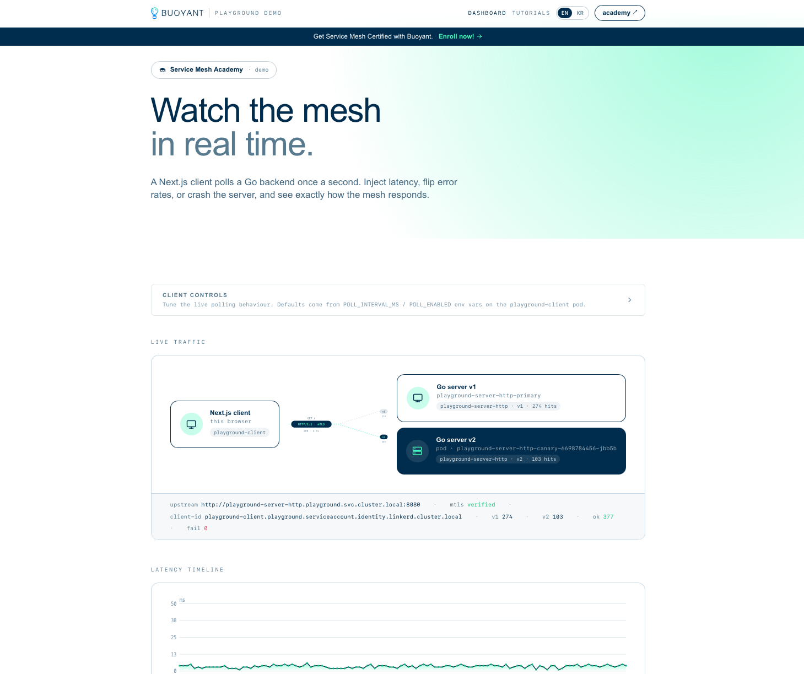
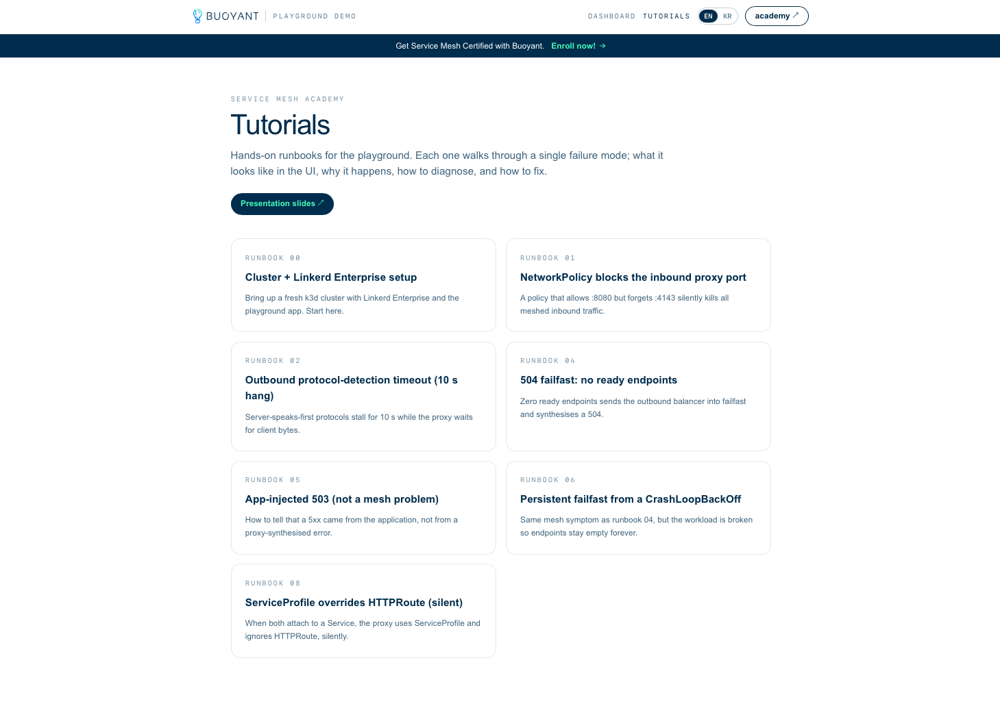

# playground-laboratory

Reproducible failure modes for Linkerd Enterprise: a deliberately-breakable Go server + Next.js client + 15 runbooks that walk through 5xx synthesis, failfast, mTLS pinning, CNI race conditions, trust-anchor rotation, and more. Designed for Service Mesh Academy training sessions on a fresh k3d cluster.

## Repo layout

| Path        | What it is                                                                 |
| ----------- | -------------------------------------------------------------------------- |
| `server/`   | Go HTTP server with env-driven fault injection (latency, errors, crash)    |
| `client/`   | Next.js dashboard + in-pod traffic generator                               |
| `helm/`     | Chart that wires server + client into a meshed `playground` namespace      |
| `runbook/`  | Long-form failure-mode walkthroughs                                        |
| `doc/`      | Developer docs, see [`doc/development.md`](doc/development.md)             |

## Dashboard

## In-app tutorials

