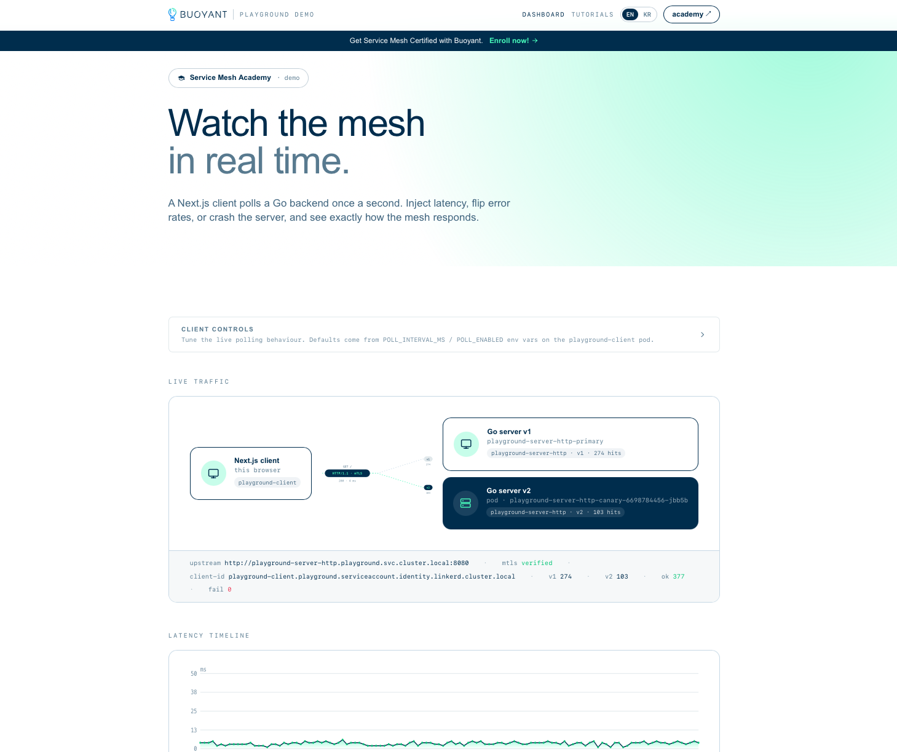
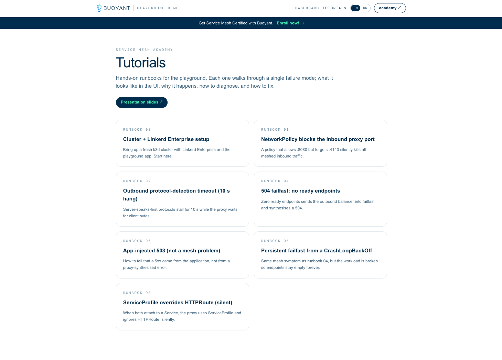

# playground-laboratory

Reproducible failure modes for Linkerd Enterprise: a deliberately-breakable Go server + Next.js client + 15 runbooks that walk through 5xx synthesis, failfast, mTLS pinning, CNI race conditions, trust-anchor rotation, and more. Designed for Service Mesh Academy training sessions on a fresh k3d cluster.

## Repo layout

| Path        | What it is                                                                 |
| ----------- | -------------------------------------------------------------------------- |
| `server/`   | Go HTTP server with env-driven fault injection (latency, errors, crash)    |
| `client/`   | Next.js dashboard + in-pod traffic generator                               |
| `helm/`     | Chart that wires server + client into a meshed `playground` namespace      |
| `runbook/`  | Long-form failure-mode walkthroughs                                        |
| `doc/`      | Developer docs, see [`doc/development.md`](doc/development.md)             |

## Dashboard



## In-app tutorials



## Install

The release ships two container images (`playground-app`, `playground-server`) and a
Helm chart, all published to GHCR.

### Prerequisites

- A Kubernetes cluster — a fresh [k3d](https://k3d.io) cluster is the intended target
- [Linkerd](https://linkerd.io) installed in the cluster — the chart annotates its namespace with `linkerd.io/inject: enabled`
- [Helm](https://helm.sh) 3.8+ (for OCI registry support)

### Install the chart

The chart creates the meshed `playground` namespace and deploys the Go server
(primary + canary), the dashboard, and the traffic generator:

```sh
helm install playground \
  oci://ghcr.io/buoyantio/playground-laboratory/charts/playground \
  --version 1.0.12 \
  --namespace playground \
  --create-namespace
```

> Omit `--version` to pull the latest published chart. The chart owns the
> `playground` namespace, so `--create-namespace` is not needed.

### Open the dashboard

```sh
kubectl -n playground port-forward svc/playground-dashboard 3000:3000
open http://localhost:3000
```

### Inject a failure

Every fault is an env knob you flip at runtime with `helm upgrade` — e.g. make the
canary slow and flaky:

```sh
helm upgrade playground \
  oci://ghcr.io/buoyantio/playground-laboratory/charts/playground \
  --version 1.0.12 --namespace playground --reuse-values \
  --set http.canary.env.LATENCY_MS=2000 \
  --set http.canary.env.ERROR_RATE=30 \
  --set http.canary.env.ERROR_CODE=503 \
  --create-namespace
```

See the [`runbook/`](runbook/) walkthroughs and the in-app tutorials for the full
failure catalogue.

### Optional: bundled Prometheus + Grafana

Both are off by default and install into a `monitoring` namespace:

```sh
helm install playground \
  oci://ghcr.io/buoyantio/playground-laboratory/charts/playground \
  --version 1.0.12 --namespace playground \
  --set prometheus.enabled=true \
  --set grafana.enabled=true \
  --create-namespace
```

### Uninstall

```sh
helm uninstall playground --namespace playground
```

## Local development

Prefer to run it without a cluster? See [`doc/development.md`](doc/development.md) to
run the server, dashboard, and generator directly on your machine.
