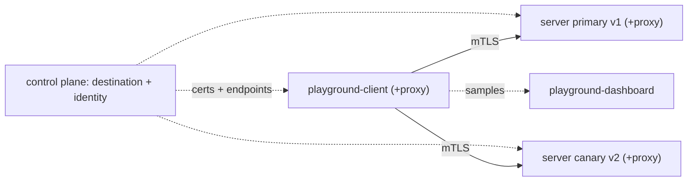

# 00 - Cluster + Linkerd Enterprise setup

Every runbook starts from a fresh k3d cluster with Linkerd Enterprise (BEL) installed and the playground laboratory deployed. This is the canonical walkthrough; every other runbook has a condensed "## Setup" section that references it.

## The mesh at a glance

Every tutorial works against this topology: two meshed apps talking over mTLS, with the control plane issuing identities and endpoints to each proxy:



## Prerequisites on your machine

```sh
# k3d
brew install k3d            # or: curl -s https://raw.githubusercontent.com/k3d-io/k3d/main/install.sh | bash

# kubectl, helm (3.8+ required for OCI registries)
brew install kubectl helm

# Linkerd Enterprise CLI (BEL)
curl --proto '=https' --tlsv1.2 -sSfL https://enterprise.buoyant.io/install | sh
export PATH="$HOME/.linkerd2/bin:$PATH"
linkerd version

# Buoyant Enterprise license (env var consumed by `linkerd install`)
export BUOYANT_LICENSE='<your license string>'
```

> If you don't have a BEL license, the same runbooks work against open-source Linkerd.

## 1. Create a k3d cluster

```sh
k3d cluster create playground \
  --servers 1 --agents 1 \
  --image rancher/k3s:v1.30.1-k3s1 \
  --k3s-arg '--disable=traefik@server:*' \
  --port '8081:80@loadbalancer'
kubectl cluster-info
```

Two nodes (one server + one agent) make the CNI-race and SA-recreation (with pod rescheduling) scenarios easier to demonstrate. The `--port '8081:80@loadbalancer'` mapping exposes the ingress controller on the host (`localhost:8081`) for the ingress runbook and is inert for all others, so this single cluster serves every runbook.

## 2. Install Linkerd Enterprise

```sh
# Install Gateway API CRDs
kubectl apply --server-side -f https://github.com/kubernetes-sigs/gateway-api/releases/download/v1.4.0/standard-install.yaml

# CRDs first, in their own apply.
linkerd install --crds | kubectl apply -f -

# Control plane.
linkerd install | kubectl apply -f -

# Wait for everything to be Ready, and validate.
linkerd check
```

## 3. Deploy the playground

Chart and images are published as public OCI artifacts on GHCR:

```sh
helm install demo \
  oci://ghcr.io/buoyantio/playground-laboratory/charts/playground \
  --version 1.1.0

kubectl -n playground rollout status \
  deploy/playground-server-http-primary \
  deploy/playground-server-http-canary \
  deploy/playground-dashboard \
  deploy/playground-client
```

The `playground` namespace is annotated `linkerd.io/inject: enabled`, so all four deployments start with a `linkerd-proxy` sidecar. **`playground-client`** is the always-on traffic generator that every runbook instruments. **`playground-dashboard`** is the UI that displays its traffic flow and owns the live config the generator reads.

## 4. Open the dashboard

```sh
kubectl -n playground port-forward svc/playground-dashboard 3000:3000
open http://localhost:3000
```

You should see a steady stream of green `200`s, few-millisecond latency, and an **mTLS** badge on every row of the "Recent samples" table. The Topology banner reads `HTTP/1.1 · mTLS` and the `mtls verified` chip is green.

When the proxy is bypassed or mTLS breaks, the badge flips to **plain** and the protocol banner turns red. This is the visual signal used throughout the runbooks.

## The diagnostic toolkit

Every runbook uses these five techniques:

```sh
# 1. Proxy metrics
linkerd diagnostics proxy-metrics -n playground deploy/playground-client
kubectl port-forward -n playground deploy/playground-client 4191
curl localhost:4191/metrics
# ...or filter them in-pod:
kubectl -n playground exec deploy/playground-client -c linkerd-proxy -- \
  curl -s http://localhost:4191/metrics | grep -E 'failfast|response_total|endpoints'

# 2. Proxy logs
kubectl logs -n playground deploy/playground-client -c linkerd-proxy --tail=50 -f

# 3. Raise proxy log level at runtime (no restart needed). Default is "info".
kubectl port-forward -n playground deploy/playground-client 4191
curl -v --data 'linkerd=debug' -X PUT localhost:4191/proxy-log-level

# 4. Endpoint membership
linkerd diagnostics endpoints playground-server-http.playground.svc.cluster.local:8080

# 5. Curl the destination from inside a meshed peer, with -v to see headers.
POD=$(kubectl get pod -n playground -l app=playground-client -o jsonpath='{.items[0].metadata.name}')
kubectl debug -n playground "$POD" --image=nicolaka/netshoot --profile=general --quiet -i -- \
  curl -sv http://playground-server-http.playground.svc.cluster.local:8080/ 2>&1 | tail -15
# Look for: l5d-proxy-error, l5d-proxy-connection, l5d-client-id
```

## Reset between runbooks

```sh
# Drop policy, route and network resources back to defaults.
kubectl -n playground delete httproute,authorizationpolicy,meshtlsauthentication,\
networkauthentication,server.policy.linkerd.io,networkpolicy --all \
  --ignore-not-found

# Reset the Helm release.
helm upgrade demo \
  oci://ghcr.io/buoyantio/playground-laboratory/charts/playground \
  --set prometheus.enabled=true \
  --set grafana.enabled=true \
  --version 1.1.0
kubectl -n playground rollout status \
  deploy/playground-server-http-primary \
  deploy/playground-server-http-canary \
  deploy/playground-dashboard \
  deploy/playground-client
```

If a runbook leaves the cluster in a broken state (e.g. trust anchor mismatch), tear it down and start over rather than untangling:

```sh
k3d cluster delete playground
```
