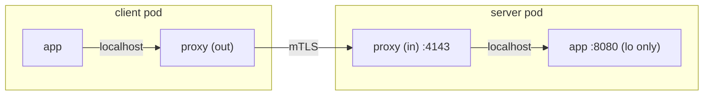

# 01 - NetworkPolicy blocks the inbound proxy port

The Linkerd inbound proxy listens on `:4143` for meshed traffic and `:4191`
for the admin server. A `NetworkPolicy` that selects meshed pods but omits
`:4143` silently kills all inbound mesh traffic, even if the application
port (`:8080` here) is still listed.

The result looks like a connection-refused 502, but the failure point is the
CNI plugin enforcing the policy, not the workload.

## Setup

> **This is the one runbook that needs its own cluster.** Every other panel
> runs against the [00-setup.md](00-setup.md) cluster as-is. NetworkPolicy
> enforcement requires a CNI chosen at cluster-create time. k3d's default
> (flannel) doesn't enforce it, so you recreate the playground cluster
> with Cilium before deploying.

```sh
k3d cluster delete playground 2>/dev/null
k3d cluster create playground \
  --servers 1 --agents 1 \
  --image rancher/k3s:v1.30.1-k3s1 \
  --k3s-arg '--disable=traefik@server:*' \
  --k3s-arg '--flannel-backend=none@server:*' \
  --k3s-arg '--disable-network-policy@server:*'

helm repo add cilium https://helm.cilium.io/
helm repo update
helm install cilium cilium/cilium --version 1.15.5 \
  --namespace kube-system \
  --set operator.replicas=1
kubectl -n kube-system rollout status ds/cilium --timeout=2m
```

Then install Linkerd Enterprise and the playground chart from
[00-setup.md](00-setup.md) (steps 2–3). Baseline should be green.

## Symptom

- Client UI: every poll red `502`. mTLS badge shows "plain" (no response from
  the meshed peer).
- Latency near-instant.
- Server pod is `Ready`, server app is happy serving, to local-loopback
  callers.
- `kubectl exec` into the server pod and `curl localhost:8080` works.

## Recreate

Apply a NetworkPolicy that allows app traffic on `:8080` but forgets `:4143`:

```sh
kubectl apply -f - <<'EOF'
apiVersion: networking.k8s.io/v1
kind: NetworkPolicy
metadata:
  name: playground-server-only-8080
  namespace: playground
spec:
  podSelector:
    matchLabels:
      app: playground-server-http
  policyTypes: ["Ingress"]
  ingress:
    - from:
        - podSelector:
            matchLabels:
              app: playground-client
      ports:
        - protocol: TCP
          port: 8080
EOF
```

The policy allows the app port but closes the mesh. Inbound traffic in a
meshed pod arrives on `:4143`, not `:8080`.

> **Note: same bug, `CiliumNetworkPolicy` form.** Because this cluster runs
> Cilium, the same scenario can be written as a `CiliumNetworkPolicy`
> (`cilium.io/v2`) or its cluster-wide variant `CiliumClusterwideNetworkPolicy`.
> CNP shares the same L4 port/protocol shape as standard `NetworkPolicy`,
> so the missing-`:4143` mistake reproduces verbatim:
>
> ```yaml
> apiVersion: cilium.io/v2
> kind: CiliumNetworkPolicy
> metadata:
>   name: playground-server-only-8080
>   namespace: playground
> spec:
>   endpointSelector:
>     matchLabels:
>       app: playground-server-http
>   ingress:
>     - fromEndpoints:
>         - matchLabels:
>             app: playground-client
>       toPorts:
>         - ports:
>             - port: "8080"
>               protocol: TCP
> ```
>
> CNP adds identity/service-account selectors, DNS-based egress, and L7
> rules (`rules.http`, `rules.dns`, `rules.kafka`). None of those change
> the proxy-port story; they just add more ways to silently exclude `:4143`
> and `:4191` from the allow set. Diagnosis and fix are identical: include
> the proxy ports.

## What you'll see

Client-side outbound proxy logs:

```sh
kubectl -n playground logs deploy/playground-client -c linkerd-proxy --tail=10
```

```
[  1589.462218s]  INFO ThreadId(01) outbound:proxy{addr=10.43.67.169:8080}:rescue{client.addr=10.0.1.145:36552}: linkerd_app_core::errors::respond: HTTP/1.1 request failed error=logical service 10.43.67.169:8080: route default.http: service unavailable error.sources=[route default.http: service unavailable, service unavailable]
[  1619.469625s]  WARN ThreadId(01) outbound:proxy{addr=10.43.67.169:8080}:service{ns=playground name=playground-server-http port=8080}:endpoint{addr=10.0.0.120:8080}: linkerd_reconnect: Failed to connect error=connect timed out after 1s
[  1619.469672s]  WARN ThreadId(01) outbound:proxy{addr=10.43.67.169:8080}:service{ns=playground name=playground-server-http port=8080}:endpoint{addr=10.0.0.145:8080}: linkerd_reconnect: Failed to connect error=connect timed out after 1s
[  1620.574116s]  WARN ThreadId(01) outbound:proxy{addr=10.43.67.169:8080}:service{ns=playground name=playground-server-http port=8080}:endpoint{addr=10.0.0.145:8080}: linkerd_reconnect: Failed to connect error=connect timed out after 1s
[  1620.579566s]  WARN ThreadId(01) outbound:proxy{addr=10.43.67.169:8080}:service{ns=playground name=playground-server-http port=8080}:endpoint{addr=10.0.0.120:8080}: linkerd_reconnect: Failed to connect error=connect timed out after 1s
[  1621.471035s]  INFO ThreadId(01) outbound:proxy{addr=10.43.67.169:8080}:service{ns=playground name=playground-server-http port=8080}: linkerd_proxy_balance_queue::worker: Unavailable; entering failfast timeout=3.0
[  1621.471126s]  INFO ThreadId(01) outbound:proxy{addr=10.43.67.169:8080}:rescue{client.addr=10.0.1.145:34960}: linkerd_app_core::errors::respond: HTTP/1.1 request failed error=logical service 10.43.67.169:8080: route default.http: backend Service.playground.playground-server-http:8080: Service.playground.playground-server-http:8080: service in fail-fast error.sources=[route default.http: backend Service.playground.playground-server-http:8080: Service.playground.playground-server-http:8080: service in fail-fast, backend Service.playground.playground-server-http:8080: Service.playground.playground-server-http:8080: service in fail-fast, Service.playground.playground-server-http:8080: service in fail-fast, service in fail-fast]
```

Curl from the meshed client:

```sh
POD=$(kubectl get pod -n playground -l app=playground-client -o jsonpath='{.items[0].metadata.name}')
kubectl debug -n playground "$POD" --image=nicolaka/netshoot --profile=general --quiet -i -- \
  curl -sv http://playground-server-http.playground.svc.cluster.local:8080/ 2>&1 \
  | grep -E '< HTTP|< l5d'
```

```
< HTTP/1.1 504 Gateway Timeout
< l5d-proxy-error: logical service 10.43.67.169:8080: route default.http: backend Service.playground.playground-server-http:8080: Service.playground.playground-server-http:8080: service in fail-fast
< l5d-proxy-connection: close
```

### Direct port test

The goal is to prove on the wire that `:4143` is dropped while `:8080` is
allowed. With Linkerd's iptables rules in play on both ends, naive probes
lie. The next three sections show one trap and two valid tests.

```sh
SERVER_IP=$(kubectl -n playground get pod -l app=playground-server-http \
  -o jsonpath='{.items[0].status.podIP}')
POD=$(kubectl -n playground get pod -l app=playground-client \
  -o jsonpath='{.items[0].metadata.name}')
```

#### Trap: `kubectl debug --profile=general` (false positive)

```sh
kubectl debug -n playground "$POD" \
  --image=nicolaka/netshoot --profile=general --quiet -i -- \
  nc -zv -w 3 "$SERVER_IP" 4143
# Connection to 10.0.0.120 4143 port [tcp/*] succeeded!
```

The debug container shares the meshed pod's netns and inherits the
`linkerd-init` iptables rules. The `OUTPUT` chain redirects all outbound
TCP from non-proxy UIDs to `127.0.0.1:4140` (the local outbound proxy),
which accepts every SYN. The packet never leaves the pod; you are
handshaking with your own proxy, not the server. Cilium and the
NetworkPolicy are never consulted.

#### Test 1: run as the proxy UID (exempt from the redirect)

Linkerd's `OUTPUT` chain has `-m owner --uid-owner 2102 -j RETURN`, so
traffic from UID `2102` (the proxy) bypasses the redirect. Override
`runAsUser` on the ephemeral container and the SYN reaches the wire:

```sh
cat > /tmp/proxy-uid.json <<'EOF'
{
  "securityContext": { "runAsUser": 2102 }
}
EOF

kubectl debug -n playground "$POD" \
  --image=nicolaka/netshoot --profile=general \
  --custom=/tmp/proxy-uid.json \
  --quiet -i -- \
  nc -zv -w 3 "$SERVER_IP" 4143
# nc: connect to 10.0.0.120 port 4143 (tcp) timed out: Operation in progress
```

`timed out` (not `Connection refused`): Cilium's eBPF policy silently
drops the packet because no rule matches `:4143`. Calico in iptables mode
would return `Connection refused` instead.

#### Test 2: probe from an unmeshed pod with the matching label

No iptables rules in this pod, so packets go out unmodified. The pod
carries `app=playground-client`, so the policy's `from` clause still
matches, isolating the result to the port check:

```sh
kubectl apply -f - <<'EOF'
apiVersion: v1
kind: Pod
metadata:
  name: netshoot
  namespace: playground
  labels:
    app: playground-client
  annotations:
    linkerd.io/inject: disabled
spec:
  restartPolicy: Never
  containers:
    - name: netshoot
      image: nicolaka/netshoot
      command: ["sleep", "3600"]
EOF
kubectl -n playground wait --for=condition=Ready pod/netshoot --timeout=5m

# :4143 - policy denies, Cilium drops the SYN
kubectl -n playground exec netshoot -- nc -zv -w 3 "$SERVER_IP" 4143
# nc: connect to 10.0.0.120 port 4143 (tcp) timed out: Operation in progress

# :8080 - policy allows; PREROUTING on the server pod redirects the SYN
# to :4143 where the inbound proxy answers. The app never sees it.
kubectl -n playground exec netshoot -- nc -zv -w 3 "$SERVER_IP" 8080
# Connection to 10.0.0.120 8080 port [tcp/http-alt] succeeded!

kubectl -n playground delete pod netshoot
```

Note: the `:8080` "success" is the *inbound proxy* accepting the
handshake after PREROUTING redirects the packet from `:8080` to `:4143`
inside the server pod, not the application on loopback. Both tests agree:
`:4143` is dropped on the wire, matching the `connect timed out` in the
outbound proxy logs above.

## Why this happens

A meshed pod's traffic flow:



`linkerd-init` (or the linkerd-cni plugin) installs iptables rules that
redirect all inbound non-localhost traffic to the proxy on `:4143`. The
app listens only on loopback. Block `:4143` and the proxy cannot accept
the connection; the outbound side sees ECONNREFUSED, the same code path as
an ordinary connection refusal but a completely different root cause.

## Diagnose

```sh
# 1. Are there NetworkPolicies in the namespace?
kubectl -n playground get networkpolicy

# 2. Read each one - what ports do they allow ingress to?
kubectl -n playground get networkpolicy -o yaml \
  | grep -E 'name:|port:|protocol:'

# 3. Does the policy mention :4143 or :4191? If not, it's wrong.

# 4. Confirm the app is healthy by bypassing the mesh entirely:
kubectl -n playground port-forward deploy/playground-server-http-primary 18080:8080
curl -s http://localhost:18080/   # works, pod loopback, no iptables
```

## Fix

Add `4143` (and `4191` if you scrape proxy metrics) to the allowed ports.
The app port `:8080` is not needed; inbound traffic never arrives on it
directly:

```sh
kubectl apply -f - <<'EOF'
apiVersion: networking.k8s.io/v1
kind: NetworkPolicy
metadata:
  name: playground-server-only-8080
  namespace: playground
spec:
  podSelector:
    matchLabels:
      app: playground-server-http
  policyTypes: ["Ingress"]
  ingress:
    - from:
        - podSelector:
            matchLabels:
              app: playground-client
      ports:
        - protocol: TCP
          port: 4143    # inbound proxy data plane
        - protocol: TCP
          port: 4191    # proxy admin / metrics
EOF
```

Adding `8080` to the policy neither fixes nor breaks anything; it just
makes the author think they are allowing real traffic. That is how this
mistake survives in codebases for months.

## Revert

```sh
kubectl -n playground delete networkpolicy playground-server-only-8080
```
