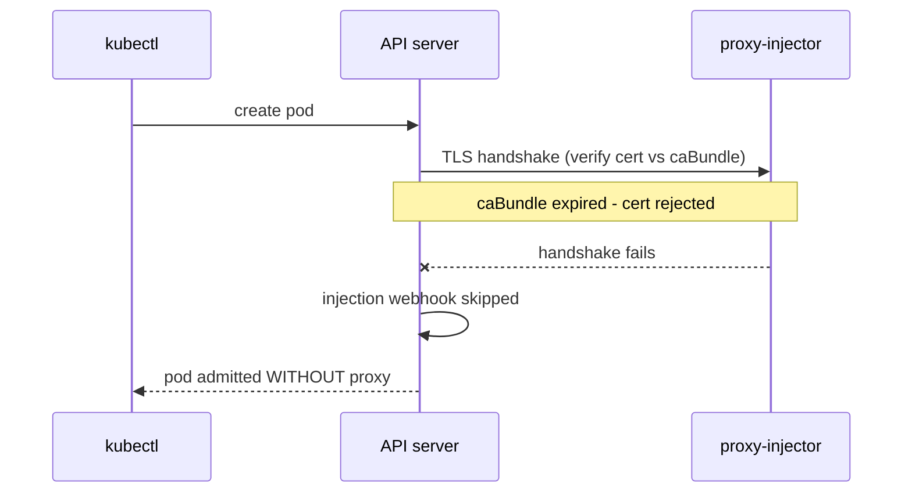

# 09 - 만료된 웹훅 `caBundle`이 Pod admission을 차단함

Linkerd Enterprise는 `MutatingWebhookConfiguration` 하나(`linkerd-proxy-injector-webhook-config`)와 두 개의 `ValidatingWebhookConfiguration`(`linkerd-policy-validator-webhook-config`, `linkerd-sp-validator-webhook-config`)을 등록합니다. API 서버는 Pod, Policy, ServiceProfile 생성 시 각 웹훅을 호출하며, `clientConfig.caBundle`을 사용해 웹훅의 TLS 서버 인증서를 검증합니다. caBundle이 만료되면 API 서버는 웹훅에 연결할 수 없고, 프록시 주입과 Policy / ServiceProfile 생성이 모두 실패합니다.

`clientConfig.caBundle`은 Helm 설치 시 생성되는 유효기간 365일짜리 자체 서명 인증서입니다. 현장에서 흔한 원인은 1년 이상 Linkerd를 업그레이드하지 않아 인증서가 만료되는 경우입니다.

## 설치

[00-setup.md](00-setup.md)를 따라 클러스터, Linkerd Enterprise, playground 앱을 준비하세요. 시작 전에 UI에서 `mTLS` 배지와 함께 초록색 `200` 응답이 표시되어야 합니다.

## 증상

- 기존 Pod들은 계속 동작하고 UI는 초록색 `200` 응답을 계속 표시합니다.
- **`playground` 네임스페이스에서 새로 생성된 Pod에 `linkerd-proxy`
  사이드카가 주입되지 않습니다.**
- **`playground` 네임스페이스에서 새로운 `ServiceProfile`이나
  policy 리소스 생성이 실패합니다.**

이 장애는 admission 시점에서 발생하며 데이터 플레인의 문제가 아닙니다. 기존 워크로드는 정상이고, 다음 배포부터 실패하는 유형입니다.

## 재현

caBundle을 이미 만료될 예정인 자체 서명 인증서로 교체합니다:

```sh
# 2분 후에 만료되는 인증서를 생성합니다.
NOT_BEFORE=$(date -u +%Y%m%d%H%M%SZ)
NOT_AFTER=$(date -u -v+2M +%Y%m%d%H%M%SZ)
openssl req -x509 -newkey rsa:2048 -nodes \
  -not_before "$NOT_BEFORE" -not_after "$NOT_AFTER" \
  -keyout /tmp/expiring.key -out /tmp/expiring.crt \
  -subj "/CN=expiring"

EXPIRED_B64=$(base64 < /tmp/expiring.crt | tr -d '\n')

# proxy-injector 웹훅에 패치를 적용합니다.
kubectl patch mutatingwebhookconfiguration \
  linkerd-proxy-injector-webhook-config \
  --type='json' \
  -p="[{\"op\":\"replace\",\"path\":\"/webhooks/0/clientConfig/caBundle\",\"value\":\"${EXPIRED_B64}\"}]"
```

서버를 스케일하여 새 Pod 생성을 강제합니다:

```sh
kubectl -n playground scale deploy -l app=playground-server-http --replicas=2
```

## 무엇이 보일까

새 Pod에 프록시가 주입되지 않습니다:

```
playground    playground-server-http-primary-5c7df787c8-2qvjp   1/1     Running   0          8s
playground    playground-server-http-canary-5c6b6bbc99-zpg4l    1/1     Running   0          8s
```

망가진 caBundle을 확인합니다:

```sh
kubectl get mutatingwebhookconfiguration \
  linkerd-proxy-injector-webhook-config \
  -o jsonpath='{.webhooks[0].clientConfig.caBundle}' \
  | base64 -d | openssl x509 -noout -dates
```

```
notBefore=May 14 12:08:31 2026 GMT
notAfter=May 14 12:09:31 2026 GMT
```

`linkerd check`도 이를 감지합니다:

```sh
linkerd-webhooks-and-apisvc-tls
-------------------------------
× proxy-injector webhook has valid cert
    anchors not within their validity period:
	* 552409261965999710590609819328603539685614650070 expiring not valid anymore. Expired on 2026-05-14T12:09:31Z
    see https://linkerd.io/2/checks/#l5d-proxy-injector-webhook-cert-valid for hints
```

실행 중인 Pod들은 영향을 받지 않으며, UI는 초록색 응답을 계속 표시합니다.

## 왜 이런 일이 일어나는가



Kubernetes는 `clientConfig.caBundle`을 사용해 `linkerd-proxy-injector.linkerd.svc:443` 등 validating webhook의 TLS 인증서를 검증합니다. 흐름은 API 서버 → webhook svc (TLS) → injector/validator Pod입니다. caBundle이 서버 인증서를 검증하지 못하면, API 서버는 admission 요청을 전송하기 전 TLS 핸드셰이크 단계에서 연결을 거부합니다.

injector Pod 자체와 Pod가 제시하는 TLS 인증서는 정상입니다. 문제는 API 서버가 그 인증서를 검증할 때 참조하는 신뢰(trust) 입력값에만 있습니다.

proxy-injector는 Pod *생성* 시점에만 호출됩니다. 한 번 주입된 사이드카는 웹훅의 추가 개입 없이 계속 동작하므로, 실행 중인 Pod들은 영향을 받지 않습니다.

## 진단

```sh
# 1. 각 Linkerd 웹훅의 caBundle을 확인합니다.
for w in linkerd-proxy-injector-webhook-config \
         linkerd-sp-validator-webhook-config \
         linkerd-policy-validator-webhook-config; do
  echo "=== $w ==="
  kubectl get mutatingwebhookconfiguration "$w" \
    -o jsonpath='{.webhooks[0].clientConfig.caBundle}' 2>/dev/null \
    | base64 -d | openssl x509 -noout -dates -subject 2>/dev/null \
    || kubectl get validatingwebhookconfiguration "$w" \
       -o jsonpath='{.webhooks[0].clientConfig.caBundle}' \
       | base64 -d | openssl x509 -noout -dates -subject
done

# 2. Linkerd의 자체 check도 이 항목을 검사합니다:
linkerd check

# 3. 정상성 확인 차원에서, injector Pod 자체는 정상입니다:
kubectl -n linkerd get pod -l linkerd.io/control-plane-component=proxy-injector
kubectl -n linkerd logs deploy/linkerd-proxy-injector --tail=20
# (조용함 - API 서버가 웹훅에 도달하지 못하기 때문에 admission 요청 자체가
# 도착하지 않습니다)
```

## 수정

`helm upgrade` 또는 `linkerd upgrade`를 실행하면 유효기간 365일짜리 새 자체 서명 인증서가 생성됩니다.

```sh
linkerd upgrade | kubectl apply -f -

helm upgrade -n linkerd linkerd-enterprise control-plane --reuse-values

linkerd check
```

운영 환경에서 cert-manager를 사용하는 경우, 동기화와 caBundle 재배포가 자동으로 처리됩니다.

## 되돌리기

`Fix` 단계에서 caBundle을 복구했습니다. 확인:

```sh
linkerd upgrade | kubectl apply -f -
```

새 Pod가 admit되고 사이드카가 주입되어 있어야 합니다.
