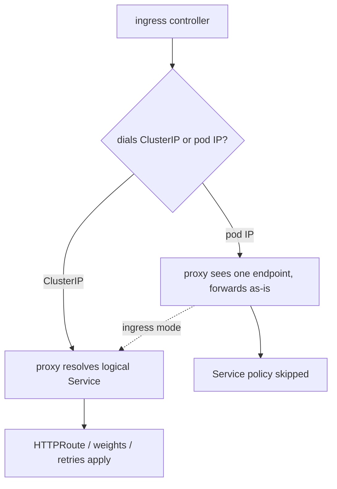

# 10 - ingress를 메시에 포함하되 Linkerd 라우팅을 우회하지 않기 (`service-upstream`, `routingType` & ingress mode)

> 📊 **슬라이드:** [nginx 및 인그레스 컨트롤러](https://docs.google.com/presentation/d/19BBQMUElJJqZr9HuAt49ckwsyarPVLAaNXRUv49Qduk/edit?usp=sharing)

Linkerd는 자체 ingress 컨트롤러를 제공하지 않습니다. 대신 기존 컨트롤러(ingress-nginx, Traefik, Envoy Gateway, kgateway 등)에 다른 워크로드와 동일하게 `linkerd-proxy` 사이드카를 주입해 메시에 포함시킵니다. 문제는 **ingress 컨트롤러가 백엔드에 도달하는 방식**에 있습니다.

대부분의 컨트롤러는 *직접* 엔드포인트를 선택합니다. 대상 Service의 `Endpoints`를 감시하다가 Pod를 하나 골라 **그 Pod의 IP로 직접** 연결합니다. Service의 ClusterIP로는 연결하지 않습니다. 메시에 포함된 컨트롤러의 outbound 프록시가 Pod IP를 향한 연결을 보면, 고정된 단일 엔드포인트로 취급해 바로 전달합니다. 그 결과 **Service** 수준의 기능이 조용히 건너뛰어집니다:

- `HTTPRoute`, 그리고 그 weight, timeout, retry, 헤더 필터.
- `ServiceProfile`.
- 트래픽 분할(traffic split) / 카나리 가중치.
- Linkerd 자체의 엔드포인트 집합에 대한 로드 밸런싱.

mTLS는 여전히 동작합니다. mTLS는 L7 아래 계층이고, destination 컨트롤러가 Pod IP를 워크로드 identity에 매핑할 수 있기 때문입니다. 따라서 이 장애는 눈에 보이지 않습니다. `200` 응답, 초록색 배지, 정상 지연 시간은 유지되는데, 카나리 `HTTPRoute`만 **아무 일도 하지 않습니다.**

해결책은 두 갈래이며, 컨트롤러를 **Service**로 연결하게 만들 수 있는지에 따라 선택합니다:

- **컨트롤러를 Service / ClusterIP로 향하게 합니다.** 프록시가 ClusterIP를 보면 논리적 Service를 resolve해 모든 정책을 적용합니다. 컨트롤러는 **일반 방식으로** 주입합니다(`linkerd.io/inject: enabled`). 최신 컨트롤러는 저마다 이를 위한 노브를 제공하며, 이 runbook의 대부분은 그 표입니다.
- **Ingress mode**(`linkerd.io/inject: ingress`). ClusterIP로 향하게 만들 수 없는 컨트롤러의 경우, 프록시가 원래 목적지 IP를 무시하고 `l5d-dst-override` 헤더를 기준으로 라우팅합니다. Pod IP를 향한 연결이라도 논리적 Service로 다시 resolve됩니다. 이 헤더는 컨트롤러별 메커니즘(Traefik `Middleware`, nginx snippet 등)으로 설정하며, ingress를 open relay로 만들지 않도록 **클라이언트가 보낸 `l5d-dst-override`를 반드시 제거해야 합니다.**

이 runbook은 **ingress-nginx, Traefik, Envoy Gateway, kgateway**에서 우회 현상을 재현하고 수정한 뒤, ingress mode의 Traefik으로 마무리합니다. 차트가 배포하는 두 서버 버전(`playground-server-http-primary`의 v1, `playground-server-http-canary`의 v2)을 apex `playground-server-http` Service 뒤에서 재사용합니다.

| 컨트롤러 | **Service**로 도달하게 만드는 방법 | Inject mode |
|---|---|---|
| ingress-nginx | Ingress에 `nginx.ingress.kubernetes.io/service-upstream: "true"` | `enabled` |
| Traefik | Service에 `traefik.ingress.kubernetes.io/service.nativelb: "true"` | `enabled` |
| Envoy Gateway 1.7 | `EnvoyProxy`에 `spec.routingType: Service` | `enabled` |
| Envoy Gateway 1.8+ | `BackendTrafficPolicy`에 `routingType: Service` (⚠ Gateway API v1.5 필요, 현재 Linkerd와 충돌) | `enabled` |
| kgateway | 호스트가 Service FQDN인 Static `Backend` | `enabled` |
| Traefik (ClusterIP 노브가 없는 경우의 대안) | ingress mode + route마다 `l5d-dst-override` | `ingress` |

## 설치

클러스터, Linkerd Enterprise, playground 앱은 모두 [00-setup.md](00-setup.md)를 따르세요. 클러스터 변경은 필요 없습니다. 이 runbook은 `localhost:8081`로 ingress에 접속하며, 00-setup의 클러스터가 해당 호스트 포트를 컨트롤러의 `:80`에 매핑해 두기 때문입니다(`--port '8081:80@loadbalancer'`, `--disable=traefik`로 호스트의 `:80`을 확보). 진행 전에 UI에서 `mTLS` 배지와 함께 초록색 `200` 응답이 확인되어야 합니다.

모든 컨트롤러는 **동일한** probe로 테스트합니다. apex Service에 연결해 트래픽을 카나리(v2)로 **100 %** 고정하는 `HTTPRoute`이며, 이것이 *ingress를 통해* 적용되는지 확인합니다. 지금 적용하세요:

```sh
kubectl apply -f - <<'EOF'
apiVersion: gateway.networking.k8s.io/v1
kind: HTTPRoute
metadata:
  name: playground-server-canary
  namespace: playground
spec:
  parentRefs:
    - name: playground-server-http
      kind: Service
      group: ""
      port: 8080
  rules:
    - matches:
        - path:
            type: PathPrefix
            value: /
      backendRefs:
        - name: playground-server-http-primary
          port: 8080
          weight: 0
        - name: playground-server-http-canary
          port: 8080
          weight: 100
EOF
kubectl -n playground get httproute
```

**메시 내부에서** 기준선을 확인합니다. 메시 내부 클라이언트는 Service로 연결해 route를 따르므로 **v2만** 응답합니다:

```sh
POD=$(kubectl -n playground get pod -l app=playground-client -o jsonpath='{.items[0].metadata.name}')
kubectl -n playground debug "$POD" \
  --image=curlimages/curl --profile=general --quiet -i -- \
  sh -c 'for i in $(seq 1 20); do
    curl -s -D - -o /dev/null http://playground-server-http.playground.svc.cluster.local:8080/ \
      | grep -i x-app-version
  done | sort | uniq -c'
# 20 x-app-version: v2
```

**Service**로 연결하는 클라이언트는 HTTPRoute를 적용받습니다. 이제 ingress 컨트롤러가 **Pod**로 연결할 때 무슨 일이 벌어지는지 보겠습니다.

ingress를 통한 모든 테스트는 클러스터가 노출한 호스트 포트로 curl하며, 서버가 각 응답에 포함하는 `X-App-Version` 헤더(v1 = primary, v2 = canary)를 읽습니다. 루프 단축용 헬퍼입니다:

```sh
# 주어진 path에 대해 ingress를 통해 응답한 버전을 출력합니다.
ver() { curl -s -D - -o /dev/null "http://localhost:8081$1" \
  | awk 'tolower($1)=="x-app-version:"{print $2}' | tr -d '\r'; }

# 누가 응답하는지 실시간 스트림 (Ctrl-C로 중지).
while true; do echo "$(date '+%H:%M:%S')  $(ver /)"; sleep 1; done
```

> **한 번에 컨트롤러 하나만.** 모든 컨트롤러가 호스트의 `:8081 → :80`을 차지하므로, 설치하고 테스트한 뒤 다음으로 넘어가기 전에 **정리**하세요(각 절 끝에 정리 명령 있음).

## ingress-nginx: `service-upstream`

ingress-nginx를 **Pod** 수준 주입으로 설치합니다:

```sh
helm repo add ingress-nginx https://kubernetes.github.io/ingress-nginx
helm repo update
helm install ingress-nginx ingress-nginx/ingress-nginx \
  --namespace ingress-nginx --create-namespace \
  --set controller.replicaCount=1 \
  --set-string 'controller.podAnnotations.linkerd\.io/inject=enabled'
kubectl -n ingress-nginx rollout status deploy/ingress-nginx-controller
```

> **네임스페이스가 아니라 Pod에 어노테이션을 답니다.** ingress-nginx는 수명이 짧은 admission `Job`(`ingress-nginx-admission-create` / `-patch`)을 실행합니다. 네임스페이스 수준의 `linkerd.io/inject`은 이 Job들도 메시에 포함시키는데, 사이드카가 종료되지 않아 Job이 완료되지 않습니다. 컨트롤러 Deployment에 Pod 수준으로 어노테이션을 달면 이를 피할 수 있습니다.

Ingress를 생성합니다. 아직 `service-upstream` 어노테이션이 **없음**에 유의하세요:

```sh
kubectl apply -f - <<'EOF'
apiVersion: networking.k8s.io/v1
kind: Ingress
metadata:
  name: playground
  namespace: playground
spec:
  ingressClassName: nginx
  rules:
    - http:
        paths:
          - path: /
            pathType: Prefix
            backend:
              service:
                name: playground-server-http
                port:
                  number: 8080
EOF
```

ingress를 통해 샘플링합니다:

```sh
for i in $(seq 1 20); do ver /; done | sort | uniq -c
```

```
  11 v1
   9 v2
```

HTTPRoute가 100 %를 v2로 고정하는데도 거의 반반으로 나뉩니다. 이 분배는 apex Service의 두 엔드포인트에 대한 **nginx 자체의** 라운드로빈입니다. Linkerd는 Service를 본 적이 없으므로 route가 발동하지 않았습니다.

route는 정상이고 accept된 상태입니다. 문제는 설정이 아니라 라우팅입니다:

```sh
linkerd diagnostics policy -n playground svc/playground-server-http 8080 | head -25
```

```
metadata:
  Kind:
    Resource:
      group: core
      kind: Service
      name: playground-server-http
      namespace: playground
      port: 8080
protocol:
  Kind:
    Detect:
      http1:
        routes:
        - metadata:
            Kind:
              Resource:
                group: gateway.networking.k8s.io
                kind: HTTPRoute
                name: playground-server-canary
```

**와이어 레벨 확인**: 컨트롤러의 outbound 프록시에서 요청이 `playground-server-canary` HTTPRoute가 아니라 합성 `endpoint` route(Pod IP 직접 전달)로 집계됩니다. route가 실행되지 않았습니다:

```sh
linkerd diagnostics proxy-metrics -n ingress-nginx deploy/ingress-nginx-controller \
  | grep '^outbound_http_route_backend_requests_total' \
  | sed -E 's/.*route_name="([^"]*)".*backend_name="([^"]*)".*\} ([0-9]+)/route=\1 backend=\2 reqs=\3/'
```

```
route=endpoint backend=unknown reqs=20
```

`tcp_open_total`은 유용한 신호가 아닙니다. 프록시는 route 적용 여부와 무관하게 모든 엔드포인트로 TCP 연결을 유지하므로, 두 경우 모두 양쪽 Pod를 보여줍니다. 라우팅 결정은 위 메트릭처럼 HTTP 계층에서만 드러납니다.

**해결책을 적용합니다.** nginx가 엔드포인트 대신 ClusterIP로 연결하도록 `service-upstream` 어노테이션을 추가합니다:

```sh
kubectl -n playground annotate ingress playground \
  nginx.ingress.kubernetes.io/service-upstream=true --overwrite
```

다시 샘플링합니다(재시작 불필요, nginx는 1~2초 내에 upstream을 리로드합니다):

```sh
for i in $(seq 1 20); do ver /; done | sort | uniq -c
```

```
  20 v2
```

이제 nginx가 프록시에 ClusterIP를 넘깁니다. 프록시는 `playground-server-http`를 resolve하고 HTTPRoute를 적용해 100 %를 카나리로 보냅니다. 와이어 레벨에서도 요청이 `playground-server-canary` route를 거쳐 canary 백엔드로 100 % 흐릅니다:

```sh
linkerd diagnostics proxy-metrics -n ingress-nginx deploy/ingress-nginx-controller \
  | grep '^outbound_http_route_backend_requests_total' \
  | sed -E 's/.*route_name="([^"]*)".*backend_name="([^"]*)".*\} ([0-9]+)/route=\1 backend=\2 reqs=\3/'
```

```
route=playground-server-canary backend=playground-server-http-canary reqs=20
route=playground-server-canary backend=playground-server-http-primary reqs=0
```

이 카운터는 누적값이므로 bypass 단계를 처리한 프록시에는 이전 `route=endpoint` 줄도 남습니다. 핵심 신호는 `route_name`이 `endpoint`에서 `playground-server-canary`로 바뀐 것입니다.

다음 컨트롤러로 넘어가기 전에 정리합니다:

```sh
kubectl -n playground delete ingress playground --ignore-not-found
helm uninstall ingress-nginx -n ingress-nginx
kubectl delete ns ingress-nginx --ignore-not-found
```

## Traefik: `service.nativelb`로 ClusterIP 사용

예전에는 Traefik에 `service-upstream`에 해당하는 옵션이 없었습니다. 이제는 있습니다. `traefik.ingress.kubernetes.io/service.nativelb: "true"` 어노테이션은 Traefik이 엔드포인트를 직접 resolve하는 대신 Service의 ClusterIP로 보내도록("native" 로드 밸런싱) 합니다. 이로써 **일반 방식으로** 주입할 수 있습니다.

Traefik을 `enabled`로 설치합니다(이 차트에는 완료되지 않는 admission Job이 없으므로 네임스페이스 어노테이션도 괜찮습니다):

```sh
helm repo add traefik https://traefik.github.io/charts
helm repo update
kubectl create namespace traefik
kubectl annotate namespace traefik linkerd.io/inject=enabled
helm install traefik traefik/traefik -n traefik
kubectl -n traefik rollout status deploy/traefik
```

**apex Service**에 어노테이션을 달아 Traefik이 ClusterIP로 연결하게 한 뒤, 해당 Service로 라우팅합니다:

```sh
kubectl -n playground annotate service playground-server-http \
  traefik.ingress.kubernetes.io/service.nativelb=true --overwrite

kubectl apply -f - <<'EOF'
apiVersion: networking.k8s.io/v1
kind: Ingress
metadata:
  name: playground
  namespace: playground
spec:
  ingressClassName: traefik
  rules:
    - http:
        paths:
          - path: /
            pathType: Prefix
            backend:
              service:
                name: playground-server-http
                port:
                  number: 8080
EOF
```

```sh
for i in $(seq 1 20); do ver /; done | sort | uniq -c
# 20 v2
```

`nativelb`는 Traefik의 `service-upstream`입니다. 이를 빼거나 `false`로 설정하면 다시 50/50 엔드포인트 우회로 돌아갑니다. 동일한 `proxy-metrics` 확인은 `-n traefik`의 `deploy/traefik`에서 동작합니다.

정리합니다:

```sh
kubectl -n playground delete ingress playground --ignore-not-found
kubectl -n playground annotate service playground-server-http \
  traefik.ingress.kubernetes.io/service.nativelb- || true
helm uninstall traefik -n traefik
kubectl delete ns traefik --ignore-not-found
```

## Envoy Gateway 1.7: `routingType: Service`

Envoy Gateway는 Gateway API 네이티브라서, 컨트롤러를 per-Ingress 어노테이션이 아니라 `GatewayClass`가 참조하는 `EnvoyProxy` 리소스로 설정합니다. 핵심 노브는 두 가지입니다. 프록시 Pod는 `envoyDeployment.pod.annotations`로 메시에 포함시키고, **`spec.routingType: Service`**가 Envoy Gateway의 `service-upstream`으로, 데이터 플레인이 엔드포인트 대신 Service/ClusterIP로 연결하게 합니다.

1.7 CRD(Envoy Gateway 자체 CRD이며, 00-setup이 이미 설치한 Gateway API CRD가 **아닙니다**)와 컨트롤러를 설치합니다:

```sh
helm template eg-crds oci://docker.io/envoyproxy/gateway-crds-helm --version v1.7.0 \
  --set crds.gatewayAPI.enabled=false \
  --set crds.envoyGateway.enabled=true \
  | kubectl apply --server-side -f -

helm install eg oci://docker.io/envoyproxy/gateway-helm --version v1.7.0 \
  -n envoy-gateway-system --create-namespace --skip-crds
```

메시에 포함된 프록시, Gateway, apex Service로 향하는 route를 설정합니다:

```sh
kubectl apply -f - <<'EOF'
apiVersion: gateway.envoyproxy.io/v1alpha1
kind: EnvoyProxy
metadata: { name: linkerd, namespace: envoy-gateway-system }
spec:
  routingType: Service          # Envoy Gateway의 service-upstream
  provider:
    type: Kubernetes
    kubernetes:
      envoyDeployment:
        pod:
          annotations:
            linkerd.io/inject: enabled
---
apiVersion: gateway.networking.k8s.io/v1
kind: GatewayClass
metadata: { name: eg-linkerd }
spec:
  controllerName: gateway.envoyproxy.io/gatewayclass-controller
  parametersRef:
    group: gateway.envoyproxy.io
    kind: EnvoyProxy
    name: linkerd
    namespace: envoy-gateway-system
---
apiVersion: gateway.networking.k8s.io/v1
kind: Gateway
metadata: { name: eg, namespace: envoy-gateway-system }
spec:
  gatewayClassName: eg-linkerd
  listeners:
    - { name: http, protocol: HTTP, port: 80, allowedRoutes: { namespaces: { from: All } } }
---
apiVersion: gateway.networking.k8s.io/v1
kind: HTTPRoute
metadata: { name: playground-ingress, namespace: playground }
spec:
  parentRefs:
    - { name: eg, namespace: envoy-gateway-system }
  rules:
    - backendRefs:
        - { name: playground-server-http, port: 8080 }
EOF
```

```sh
for i in $(seq 1 20); do ver /; done | sort | uniq -c
# 20 v2
```

Gateway의 `HTTPRoute`가 트래픽을 apex Service로 보내고, `routingType: Service`가 메시에 포함된 Envoy를 그 ClusterIP로 연결하게 합니다. 프록시는 producer 쪽 `playground-server-canary` route를 적용해 100 %를 카나리로 보냅니다. `routingType: Service`를 빼면 다시 50/50 엔드포인트 우회가 됩니다.

정리합니다:

```sh
kubectl -n playground delete httproute playground-ingress --ignore-not-found
helm uninstall eg -n envoy-gateway-system
kubectl delete ns envoy-gateway-system --ignore-not-found
```

## Envoy Gateway 1.8+: `BackendTrafficPolicy` (현재 Linkerd와 함께 사용 불가)

1.8부터 `routingType`은 `EnvoyProxy`에서 제거되고, route를 대상으로 하는 `BackendTrafficPolicy`로 이동합니다:

```sh
# EnvoyProxy / GatewayClass / Gateway / HTTPRoute는 1.7과 동일하며
# (EnvoyProxy의 routingType만 빠짐), 여기에 다음을 추가합니다:
apiVersion: gateway.envoyproxy.io/v1alpha1
kind: BackendTrafficPolicy
metadata: { name: linkerd-clusterip, namespace: playground }
spec:
  routingType: Service
  targetRefs:
    - { group: gateway.networking.k8s.io, kind: HTTPRoute, name: playground-ingress }
```

> **⚠ 주의.** Envoy Gateway 1.8은 **Gateway API v1.5.0**을 요구하지만, 이 playground(및 Linkerd)는 00-setup의 v1.4.0 CRD 세트에 고정돼 있습니다. Gateway API CRD를 클러스터 전체에서 업그레이드하면 현재 Linkerd 조합이 깨지므로 **1.8+는 이 환경에서 Linkerd와 함께 사용할 수 없습니다.** 해결될 때까지는 위의 1.7 `EnvoyProxy.routingType` 경로를 사용하세요.

## kgateway: Service로 향하는 Static `Backend`

kgateway(역시 Gateway API 네이티브)는 호스트가 **Service FQDN**인 Static `Backend`를 통해 Service에 도달합니다. 해당 이름이 ClusterIP로 resolve되므로, 메시에 포함된 Envoy가 Service로 연결하고 route가 적용됩니다. 프록시 Pod는 `GatewayParameters`로 메시에 포함시킵니다.

CRD와 컨트롤러를 설치합니다:

```sh
helm upgrade -i kgateway-crds oci://cr.kgateway.dev/kgateway-dev/charts/kgateway-crds \
    --create-namespace --namespace kgateway-system \
    --version v2.1.3
helm upgrade -i kgateway oci://cr.kgateway.dev/kgateway-dev/charts/kgateway \
    --namespace kgateway-system \
    --version v2.1.3 \
    --set controller.image.pullPolicy=Always
```

메시에 포함된 Gateway, apex Service로 향하는 Static `Backend`, route를 설정합니다:

```sh
kubectl apply -f - <<'EOF'
apiVersion: gateway.kgateway.dev/v1alpha1
kind: GatewayParameters
metadata: { name: meshed-gw-params, namespace: kgateway-system }
spec:
  kube:
    podTemplate:
      extraAnnotations:
        linkerd.io/inject: enabled
      extraVolumes:                          # k3d 임시 파일 크래시 우회책
        - { name: envoy-tmp, emptyDir: {} }
    envoyContainer:
      env: [{ name: TMPDIR, value: /tmp }]
      extraVolumeMounts:
        - { name: envoy-tmp, mountPath: /tmp }
---
apiVersion: gateway.networking.k8s.io/v1
kind: Gateway
metadata: { name: http, namespace: kgateway-system }
spec:
  gatewayClassName: kgateway
  infrastructure:
    parametersRef: { name: meshed-gw-params, group: gateway.kgateway.dev, kind: GatewayParameters }
  listeners:
    - { name: http, protocol: HTTP, port: 80, allowedRoutes: { namespaces: { from: All } } }
---
apiVersion: gateway.kgateway.dev/v1alpha1
kind: Backend
metadata: { name: playground-apex, namespace: playground }
spec:
  type: Static
  static:
    hosts:
      - { host: playground-server-http.playground.svc.cluster.local, port: 8080 }
---
apiVersion: gateway.networking.k8s.io/v1
kind: HTTPRoute
metadata: { name: playground-ingress, namespace: playground }
spec:
  parentRefs: [{ name: http, namespace: kgateway-system }]
  rules:
    - backendRefs:
        - { name: playground-apex, kind: Backend, group: gateway.kgateway.dev }
EOF
```

```sh
for i in $(seq 1 20); do ver /; done | sort | uniq -c
# 20 v2
```

> `extraVolumes` / `TMPDIR` 블록은 k3d에서 관찰된 Envoy 임시 파일 크래시를 위한 우회책이며, 메싱 요건이 아닙니다. 일반 클러스터에서는 제거하세요.

정리합니다:

```sh
kubectl -n playground delete httproute playground-ingress --ignore-not-found
kubectl -n playground delete backend playground-apex --ignore-not-found
helm uninstall kgateway -n kgateway-system
helm uninstall kgateway-crds -n kgateway-system
kubectl delete ns kgateway-system --ignore-not-found
```

## Ingress mode: `l5d-dst-override`를 쓰는 Traefik

컨트롤러를 ClusterIP로 향하게 만들 수 없을 때는 컨트롤러 대신 **프록시**를 바꿉니다. `linkerd.io/inject: ingress`로 주입합니다. 이 모드에서 프록시는 컨트롤러가 연결한 Pod IP를 무시하고 `l5d-dst-override` 헤더에서 논리적 Service를 resolve합니다. 여기서는 Traefik으로 **다중 경로** route를 구성해 각 path가 서로 다른 Service로 override되는 것을 보여줍니다.

Traefik을 **ingress** 모드로 다시 설치합니다:

```sh
kubectl create namespace traefik
kubectl annotate namespace traefik linkerd.io/inject=ingress
helm install traefik traefik/traefik -n traefik
kubectl -n traefik rollout status deploy/traefik
```

프록시가 ingress mode로 기동했는지 확인합니다. injector는 `ingress`일 때만 전용 env 변수를 설정합니다. 프록시 이미지는 distroless라서(셸 없음) Pod 스펙에서 읽습니다:

```sh
kubectl -n traefik get pod -l app.kubernetes.io/name=traefik \
  -o jsonpath='{range .items[0].spec.containers[?(@.name=="linkerd-proxy")].env[*]}{.name}={.value}{"\n"}{end}' \
  | grep -i ingress
# LINKERD2_PROXY_INGRESS_MODE=true
```

`l5d-dst-override`를 설정하는 `Middleware` 두 개(하나는 카나리 분할을 가진 apex Service로, 하나는 primary Service로 직접)와 각각을 path에 연결하는 `IngressRoute`를 정의합니다. `customRequestHeaders`는 헤더를 **덮어쓰므로** 클라이언트가 주입하려던 값도 제거되어 open relay 구멍이 막힙니다:

```sh
kubectl apply -f - <<'EOF'
apiVersion: traefik.io/v1alpha1
kind: Middleware
metadata: { name: dst-apex, namespace: playground }
spec:
  headers:
    customRequestHeaders:
      l5d-dst-override: "playground-server-http.playground.svc.cluster.local:8080"
---
apiVersion: traefik.io/v1alpha1
kind: Middleware
metadata: { name: dst-primary, namespace: playground }
spec:
  headers:
    customRequestHeaders:
      l5d-dst-override: "playground-server-http-primary.playground.svc.cluster.local:8080"
---
apiVersion: traefik.io/v1alpha1
kind: IngressRoute
metadata: { name: multipath, namespace: playground }
spec:
  entryPoints: [web]
  routes:
    - match: PathPrefix(`/apex`)
      kind: Rule
      middlewares: [{ name: dst-apex }]
      services:
        - { name: playground-server-http, port: 8080 }
    - match: PathPrefix(`/primary`)
      kind: Rule
      middlewares: [{ name: dst-primary }]
      services:
        - { name: playground-server-http-primary, port: 8080 }
EOF
```

두 path를 probe합니다:

```sh
while true; do
  echo "$(date '+%H:%M:%S')  /apex=$(ver /apex)  /primary=$(ver /primary)"
  sleep 1
done
# 20:16:16  /apex=v2  /primary=v1
```

`/apex`는 apex Service로 다시 resolve되어 `playground-server-canary` HTTPRoute가 발동해 **v2**가 됩니다. `/primary`는 primary Service로 직접 resolve되어 **v1**이 됩니다. Traefik은 둘 다 Pod IP로 연결했지만, 프록시는 그것을 무시하고 헤더를 기준으로 라우팅했습니다.

**선택: 와이어 레벨 확인.** 노드에서 Traefik의 *outbound* 프록시 포트(`4140`)에 흐르는 헤더를 관찰하면서, 다른 터미널에서 path를 curl합니다:

```sh
POD=$(kubectl -n traefik get pod -l app.kubernetes.io/name=traefik -o jsonpath='{.items[0].metadata.name}')
NODE=$(kubectl -n traefik get pod "$POD" -o jsonpath='{.spec.nodeName}')
kubectl debug node/$NODE -it --image=nicolaka/netshoot --profile=sysadmin
# 디버그 Pod 안에서:
pid=$(pgrep -x traefik | head -1)
nsenter -t "$pid" -n ngrep -d any -W byline -q -i 'l5d-dst-override' 'tcp port 4140'
# 다른 터미널에서:  curl -s localhost:8081/apex
```

와이어에서 `l5d-dst-override: playground-server-http.playground.svc.cluster.local:8080`이 보여야 합니다. Middleware가 주입한 값이며, 프록시가 라우팅의 기준으로 삼는 값입니다.

정리합니다:

```sh
kubectl -n playground delete ingressroute multipath --ignore-not-found
kubectl -n playground delete middleware dst-apex dst-primary --ignore-not-found
helm uninstall traefik -n traefik
kubectl delete ns traefik --ignore-not-found
```

## 왜 이런 일이 일어나는가



outbound 프록시는 **원래 목적지 주소(original destination address)**를 destination 컨트롤러에 질의해 연결을 결정합니다:

- **ClusterIP**(또는 ClusterIP로 resolve되는 이름) → 컨트롤러가 **논리적 Service**를 반환합니다. 엔드포인트 집합, `HTTPRoute`, `ServiceProfile`, traffic split, retry가 포함됩니다. 프록시는 완전한 L7 스택을 실행합니다.
- **Pod IP** → 컨트롤러가 그 **단일 엔드포인트**를 반환합니다. 밸런싱 대상도 없고 Service 연결 정책도 없습니다. 프록시는 그 Pod 하나로 전달합니다.

ingress 컨트롤러는 기본적으로 두 번째 경로를 택합니다. Service를 직접 `Endpoints`로 resolve해 Pod IP로 연결하므로, 메시에 포함된 컨트롤러는 기본 상태에서 단순 엔드포인트 전달로 떨어지며 모든 Service 수준 기능을 건너뜁니다. mTLS와 `200`은 영향받지 않으므로 조용히 일어납니다.

두 해결책은 같은 연결의 서로 다른 끝을 공략합니다:

- **Service로 연결**(`service-upstream`, `nativelb`, `routingType: Service`, FQDN을 향하는 Static `Backend`)은 **컨트롤러**를 바꿉니다. 프록시에 ClusterIP를 넘기면 첫 번째 항목이 적용됩니다. 일반 주입이며 프록시 쪽 설정은 없습니다.
- **Ingress mode**는 **프록시**를 바꿉니다. 원래 dst IP를 무시하고 `l5d-dst-override`에서 논리적 Service를 resolve합니다(해당 헤더가 없으면 원래 목적지). 컨트롤러는 계속 Pod IP로 연결해도 되고, 프록시가 어쨌든 Service로 다시 resolve합니다.

**보안.** ingress mode에서 프록시는 `l5d-dst-override`가 가리키는 곳이면 어디든 라우팅합니다. 외부 클라이언트가 이 헤더를 설정할 수 있으면 ingress를 **클러스터 내부나 외부의 어떤 주소로든** 중계하게 만들 수 있습니다. SSRF급 open relay입니다. 들어오는 길목에서 `l5d-dst-override`를 항상 덮어쓰거나 제거하세요. Traefik의 `customRequestHeaders`는 덮어쓰므로 이를 자동으로 처리하지만, **모든** route에 적용해야 합니다. ingress mode는 네임스페이스 전체가 아닌 컨트롤러 **Pod**에만 적용해야 하는 이유이기도 합니다.

## 진단

```sh
# 1. 컨트롤러가 메시에 포함됐는가, 그리고 어떤 모드인가? (컨트롤러별로 label 교체)
kubectl -n ingress-nginx get pod -l app.kubernetes.io/component=controller   # READY 2/2
kubectl -n traefik       get pod -l app.kubernetes.io/name=traefik           # READY 2/2
# ingress mode는 프록시에 이 env를 설정합니다. "enabled"는 설정하지 않습니다.
# 프록시는 distroless라서(`env` 바이너리 없음) Pod 스펙에서 읽습니다:
kubectl -n traefik get pod -l app.kubernetes.io/name=traefik \
  -o jsonpath='{range .items[0].spec.containers[?(@.name=="linkerd-proxy")].env[*]}{.name}={.value}{"\n"}{end}' \
  | grep -i ingress
# LINKERD2_PROXY_INGRESS_MODE=true   (ingress mode에서만)

# 2. 동작 기반 probe (명확한 테스트): 카나리 HTTPRoute가 *ingress를 통해*
#    적용되는가?
for i in $(seq 1 20); do ver /; done | sort | uniq -c
# v1과 v2 둘 다 -> Service 라우팅 우회됨
# v2만         -> Service 라우팅이 적용됨

# 3. route는 존재하고 destination 컨트롤러가 이를 인식한 상태, 즉 문제는
#    설정이 아니라 라우팅이다. (Service를 parent로 둔 HTTPRoute에는 status가
#    기록되지 않으므로, 프록시가 실제로 받는 policy를 확인한다.)
kubectl -n playground get httproute playground-server-canary
linkerd diagnostics policy -n playground svc/playground-server-http 8080 | head -25

# 4. HTTP 계층에서 어떤 route가 요청을 처리했는가? (ns/deploy를 바꿔가며.)
#    tcp_open_total은 도움이 안 된다: 프록시는 어느 경우든 모든 엔드포인트로
#    연결을 유지한다. route 집계가 신호다.
linkerd diagnostics proxy-metrics -n ingress-nginx deploy/ingress-nginx-controller \
  | grep '^outbound_http_route_backend_requests_total' \
  | sed -E 's/.*route_name="([^"]*)".*backend_name="([^"]*)".*\} ([0-9]+)/route=\1 backend=\2 reqs=\3/'
# route=endpoint ...                 = Pod IP 직접 전달 (우회됨)
# route=playground-server-canary ... = Service HTTPRoute 적용됨 (해결됨)

# 5. ingress-nginx 한정: Ingress에 service-upstream이 설정돼 있는가?
kubectl -n playground get ingress playground \
  -o jsonpath='{.metadata.annotations.nginx\.ingress\.kubernetes\.io/service-upstream}{"\n"}'
# (비어 있음) = 우회;  true = 해결됨
```

## 수정

핵심 원칙: HTTP/gRPC ingress는 백엔드에 **Service를 거쳐** 도달해야 합니다. 컨트롤러별 노브로 일반 주입을 유지하고, 노브가 없을 때만 ingress mode를 사용하세요:

| 컨트롤러 | 해결책 | Inject mode |
|---|---|---|
| ingress-nginx | Ingress에 `nginx.ingress.kubernetes.io/service-upstream: "true"` | `enabled` |
| Traefik | Service에 `traefik.ingress.kubernetes.io/service.nativelb: "true"` | `enabled` |
| Envoy Gateway 1.7 | `EnvoyProxy`에 `spec.routingType: Service` | `enabled` |
| kgateway | 호스트가 Service FQDN인 Static `Backend` | `enabled` |
| Kong / Contour / Gloo / HAProxy / GCE / EnRoute 등 ClusterIP 노브가 없는 컨트롤러 | ingress mode + route마다 `l5d-dst-override: <svc>.<ns>.svc.cluster.local:<port>` (덮어써서 들어오는 값 제거) | `ingress` |

해결책 적용 후 동작 기반 probe를 다시 실행하세요. ingress를 통한 카나리 `HTTPRoute`가 **v2만**으로 resolve되어야 합니다.

## 되돌리기

```sh
# Ingress / route 객체 (실행한 컨트롤러에 해당하는 것)
kubectl -n playground delete ingress playground --ignore-not-found
kubectl -n playground delete ingressroute multipath --ignore-not-found
kubectl -n playground delete middleware dst-apex dst-primary l5d-dst-override --ignore-not-found
kubectl -n playground delete httproute playground-ingress --ignore-not-found
kubectl -n playground delete backend playground-apex --ignore-not-found
kubectl -n playground annotate service playground-server-http \
  traefik.ingress.kubernetes.io/service.nativelb- 2>/dev/null || true

# probe route
kubectl -n playground delete httproute playground-server-canary --ignore-not-found

# 컨트롤러
helm uninstall ingress-nginx -n ingress-nginx 2>/dev/null || true
helm uninstall traefik -n traefik 2>/dev/null || true
helm uninstall eg -n envoy-gateway-system 2>/dev/null || true
helm uninstall kgateway -n kgateway-system 2>/dev/null || true
helm uninstall kgateway-crds -n kgateway-system 2>/dev/null || true
kubectl delete ns ingress-nginx traefik envoy-gateway-system kgateway-system --ignore-not-found
```
